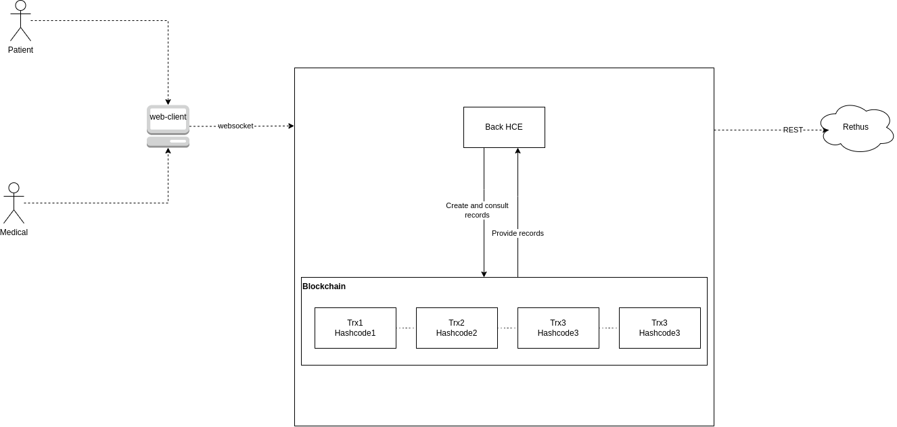

# Prototype of based-blockchain system software to store medical records

## System overview
In this project there is a prototype based-software system to manage electronic medical records according with Colombia laws in a descentralized environment and blockchain-based. The goal of this project is to provide a tool where people can manage its own medical history. In this tool they can see when, where and who is editying and who is seeing their medical data. In this project we found the backend-side of this prototype, to see the Frontend-side see **_Additional resources_**

## Team
- Andres Felipe Gomez Salinas (angomezs@correo.udistrital.edu.co)
- Jose Ricardo Ortega Ramirez (jrortegar@correo.udistrital.edu.co)

## Context Diagram
Potentially change

## Entry Points
* : A crypto wallet & gateway to blockchain apps.

## Technology stack
* : is an object-oriented, high-level language for implementing smart contracts.
* : is a community management technology that promotes Ether cryptocoin and thousands of decentralized applications.
* : A world class development environment, testing framework and asset pipeline for blockchains using the Ethereum Virtual Machine (EVM), aiming to make life as a developer easier.
* : A personal blockchain for rapid Ethereum and Corda distributed application development.
* : an open-source, cross-platform JavaScript runtime environment.

## Project Structure
- [build/contracts](build/contracts/): The contracts compiled files in JSON format.
- [contracts/logica](contracts/logica/): Domain model of application
- [contracts/logica/IteradorHCE](contracts/logica/IteradorHCE/): Contains iterator over medical history
- [contracts/logica/sistemaExterno](contracts/logica/sistemaExterno/): Oraculo to create connection with External verification medical service
- [contracts/models](contracts/models/): 
- [contracts/models/accesoHistoriaClinica](contracts/models/accesoHistoriaClinica/): Access to medical history logic
- [contracts/models/historiaClinica](contracts/models/historiaClinica/): Medical records logic
- [contracts/models/historiaClinica/enums](contracts/models/historiaClinica/enums/): Contains enum file that classify the medical records
- [contracts/models/structsGenerales](contracts/models/structsGenerales/): Comun struct that can be contained in other structs
- [contracts/models/VOGenerales](contracts/models/VOGenerales/): Value objects of data entities.
- [contracts/persistence](contracts/persistence/): Contains mappers of domain model to be storage in blockchain
- [contracts/service](contracts/service/):
- [contracts/utils](contracts/utils/):

## How to Run
- In local environment
- Instala ganache CLI y ejecuta:

    ganache-cli -p 7545 -g 20  

- Esta variante del comando permite conservar siempre que se reinicie la blockchain las mismas cuentas
    ganache-cli  --logging.debug -p 7545 -g 20 -m "dolphin person hammer artwork lens century mass agent climb into unusual dose"

- Despliege de contratos con:
    
    truffle compile

    truffle migrate -f 3 --to 3 
- Carga de datos iniciales e interconexión de contratos:

    truffle exec ./scripts/initial.js 

- Carga de usuarios por defecto
    Cuenta 8 paciente
    Cuenta 9 médico

    truffle exec ./scripts/usuariosDefault.js 

const accounts = await web3.eth.getAccounts() 

million benefit runway donor there gold cause ensure account decorate venture wonder

Private Keys
==================
(0) 0x1ed1a46178b4db75e98eb4ed17815c1b0530cda6db83e63c13e59d531415731d
(1) 0x76a6266452206ff260c498ababddff1e387bf06e5181f4350f2e7a09c6d6024a
(2) 0xfe959ed2ea30123c0b4252907381565bf3af4400624d2578a3950b364570fa09
(3) 0x7269c8b10258bd016632bfaa68af468876ec992864826d572a631df5d0adc928
(4) 0x21626a8e7468069414bc0a96e216a33e1e49bf081a8e1a9c550455076e07256b
(5) 0x830d1cffd17e57fcd77a042cbf899862d026713300c47f5b9e1a0a58eb55f814
(6) 0xb09eb042b2c10f0a6be1e3e5ddc2f3f7fc7779507868e88b61d5387419d97fe3
(7) 0x1b4963601f68d8c1d8c8a4edde202f3fc605885902d96739979898d39def02fd
(8) 0xca27e78595ea61410a2f3a55bdd88ac620d3cbccd588e75d72a1175af97b09b8
(9) 0xa43054069bbecc13c422cc9d46f205e03efe3831391e3f91383bf1b9f748021e

HD Wallet
==================
Mnemonic:      option reward combine popular estate vapor thunder brick also champion hunt combine
Base HD Path:  m/44'/60'/0'/0/{account_index}

Default Gas Price
==================
20

## Additional resources
- [Propose-frontend]()